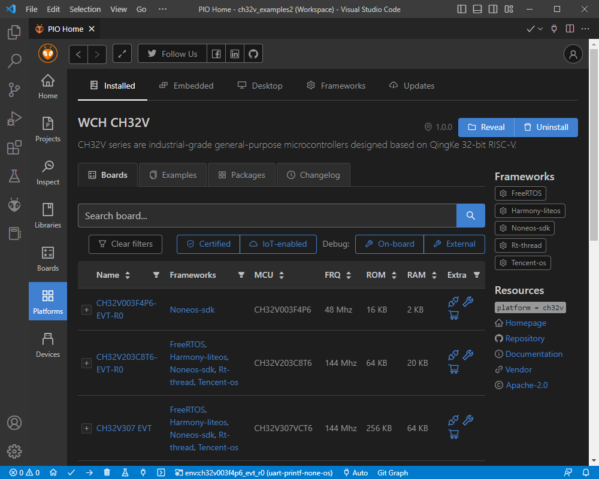
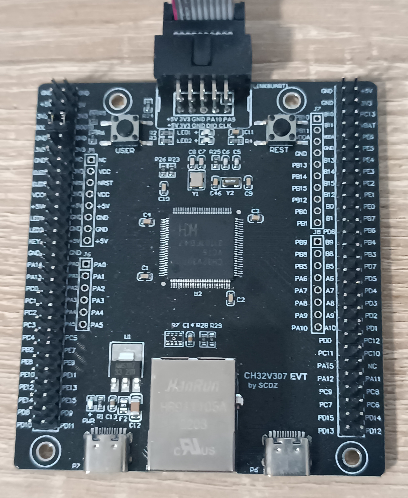
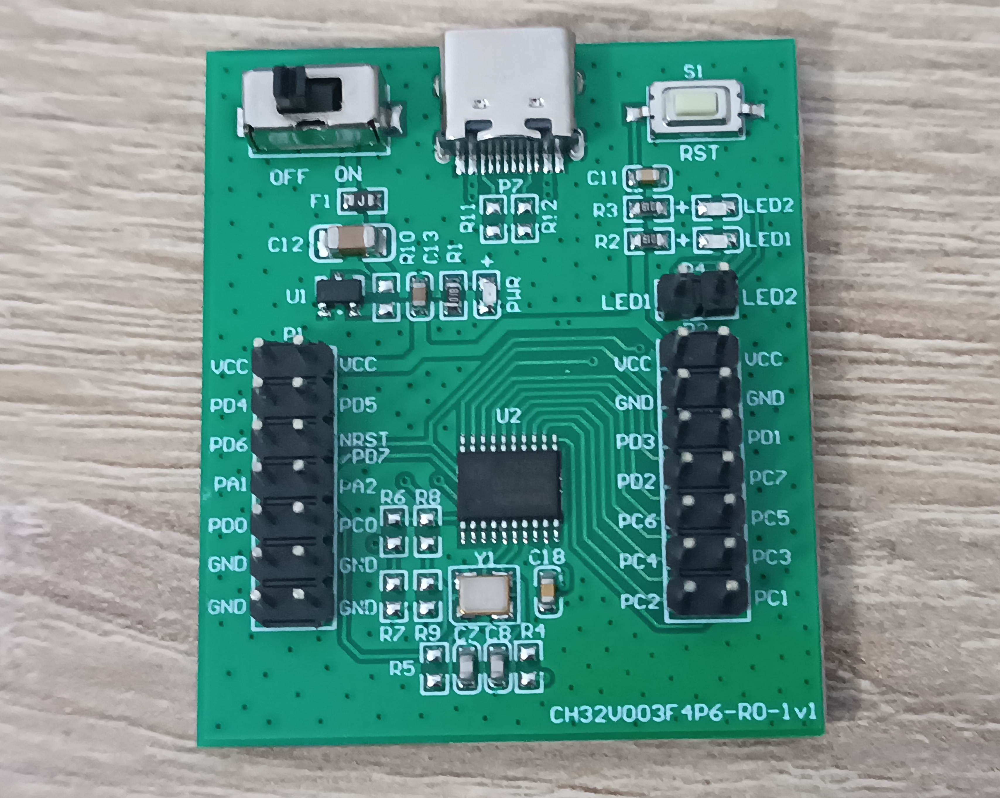
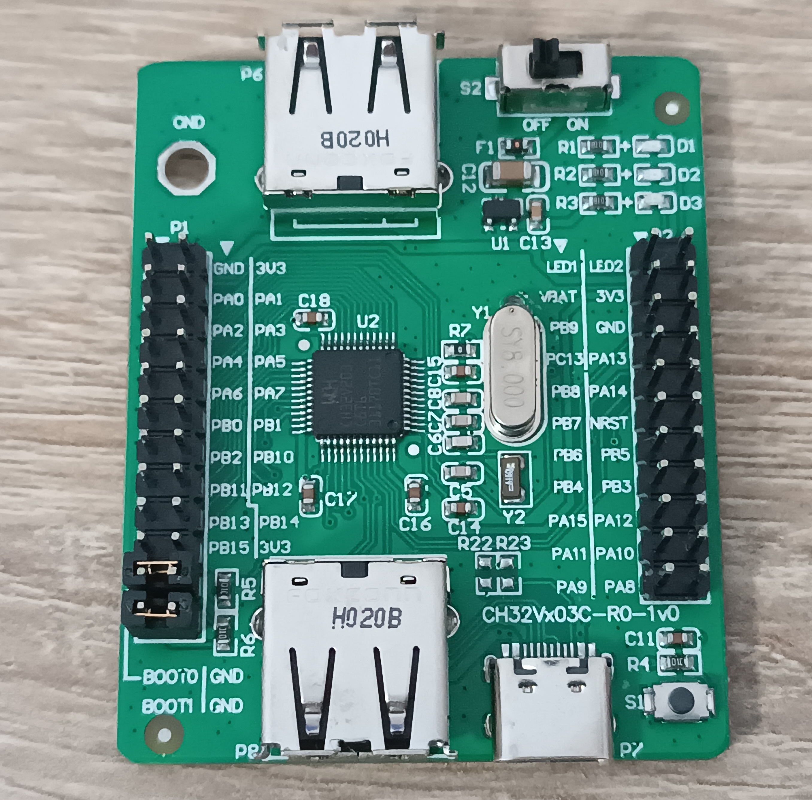

# CH32V: development platform for [PlatformIO](https://platformio.org)

[](https://github.com/Community-PIO-CH32V/platform-ch32v/actions) [](https://pio-ch32v.readthedocs.io/en/latest/?badge=latest)

The CH32V series offers industrial-grade, general-purpose microcontrollers based on a range of QingKe 32-bit RISC-V cores. All devices feature a DMA and a hardware stack area, which greatly improves interrupt latency. The family ranges from ultra-cheap, low-end CH32V003 with 2kB RAM / 16kB flash, up to high speed, ultra-connected CH32V307 with 64kB RAM / 256kB flash, hardware FPU, USB, CAN, Ethernet, etc.. For a list of available devices see the [CH32V product selector](http://www.wch-ic.com/products/categories/47.html?pid=5) page.

Note: [WCH](http://www.wch-ic.com) also offers the CH32**F** family with identical peripherals, which is based on ARM Cortex-M.

This repository is a PlatformIO platform. Just like [platform-ststm32](https://github.com/platformio/platform-ststm32/) etc., it enables the PlatformIO core to work with W.CH CH32V chips. This means in all the IDEs that PlatformIO supports ([VSCode, CLion, etc.](https://docs.platformio.org/en/latest/integration/ide/index.html)), developing and debugging firmwares for CH32V chips is easily possible.

Head over to https://github.com/Community-PIO-CH32V/ch32-pio-projects to see more example projects and detailed starting instructions.

# Documentation

Please visit https://readthedocs.org/projects/pio-ch32v/ for the most recent documention.

**This page is a work in progress at the moment.**

# Media





# Support
- chips
    - [x] CH32V003 (QingKe V2A)
    - [x] CH32V103 (QingKe V3A)
    - [x] CH32V203 (QingKe V4B)
    - [x] CH32V208 (QingKe V4C)
    - [x] CH32V303 (QingKe V4F)
    - [x] CH32V305 (QingKe V4F)
    - [x] CH32V307 (QingKe V4F)
- development boards
    - [x] CH32V003F4P6-EVT-R0 (official by W.CH)
    - [x] CH32V203C8T6-EVT-R0 (official by W.CH)
    - [x] CH32V307 EVT (by SCDZ, close to official W.CH board)
- frameworks
    - [x] None OS ("Simple Peripheral Library" / native SDK)
    - [x] FreeRTOS
    - [x] (Huawei) Harmony LiteOS
    - [x] RT-Thread
    - [x] TencentOS Lite-M
- debuggers (also implicitly uploaders)
    - [x] WCH-Link(E)
       - note: does not work on Linux + WCH-LinkE (for CH32V003), OpenOCD update pending, see #22
    - [ ] ST-Link
    - [ ] J-Link
    - [ ] GDB-UART stub for debug-probe-less debugging?
- uploaders (no debugging)
  - [x] USB ISP bootloader (supported via [wchisp](https://github.com/ch32-rs/wchisp))
# Installation

1. [Install PlatformIO](https://platformio.org)
2. Create PlatformIO project and configure a platform option in [platformio.ini](https://docs.platformio.org/page/projectconf.html) file:
3. For Linux, add PlatformIO per [documentation](https://docs.platformio.org/en/latest/core/installation/udev-rules.html#platformio-udev-rules). Then, add WCH udev rules by appending the following content to `etc/udev/rules.d/99-platformio-udev.rules`.

```
SUBSYSTEM=="usb", ATTR{idVendor}="1a86", ATTR{idProduct}=="8010", GROUP="plugdev"
SUBSYSTEM=="usb", ATTR{idVendor}="4348", ATTR{idProduct}=="55e0", GROUP="plugdev"
SUBSYSTEM=="usb", ATTR{idVendor}="1a86", ATTR{idProduct}=="8012", GROUP="plugdev"
```

**Without these udev rules or the missing group membership of the user in the plugdev group, accessing the WCH-Link(E) via OpenOCD or wchisp will not work!!**

## Development version

```ini
[env:development]
platform = https://github.com/Community-PIO-CH32V/platform-ch32v.git
board = ...
...
```

# Configuration

The configuration in regards to the builder scripts etc. are still in progress. See the above mentioned projects repository for now.

# Media Supported Development Boards




