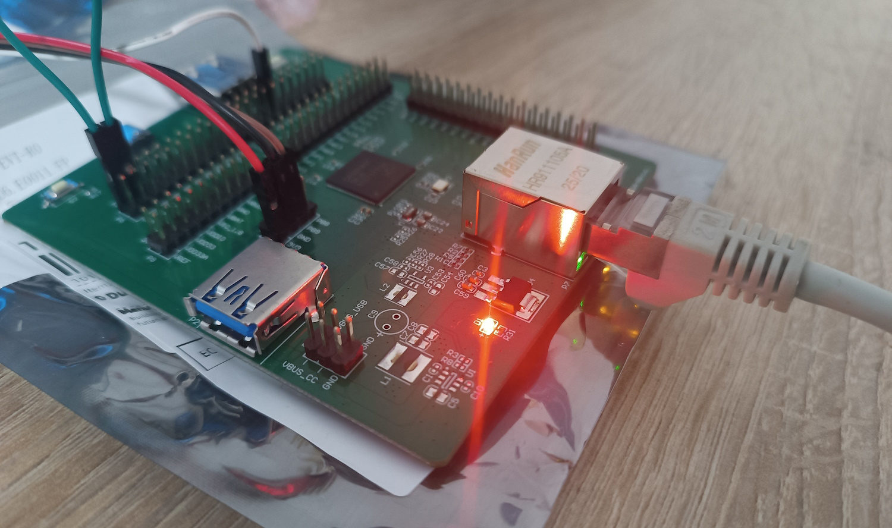
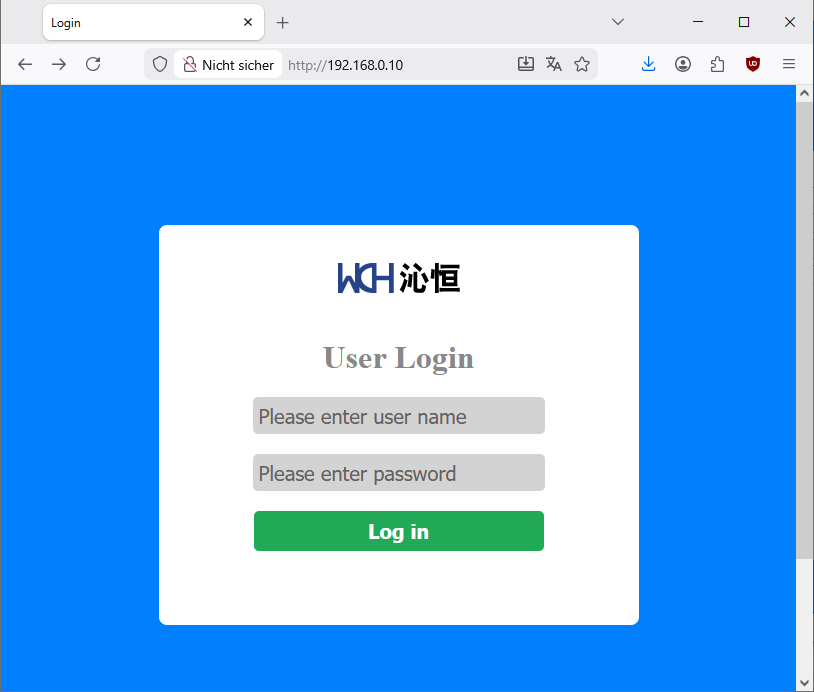
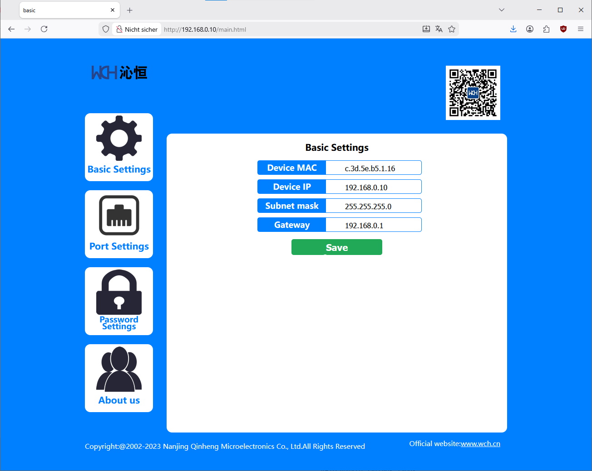

How to build PlatformIO based project
=====================================

1. [Install PlatformIO Core](https://docs.platformio.org/page/core.html)
2. Download [development platform with examples](https://github.com/Community-PIO-CH32V/platform-ch32v/archive/develop.zip)
3. Extract ZIP archive
4. Run these commands:

```shell
# Change directory to example
$ cd platform-ch32v/examples/webserver-ch32h417-none-os

# Build project
$ pio run

# Upload firmware
$ pio run --target upload

# Upload firmware for the specific environment
$ pio run -e genericCH32H417QEU6_V3F --target upload
$ pio run -e genericCH32H417QEU6_V5F --target upload

# Clean build files
$ pio run --target clean
```

## Description

This example is supposed to be run on a CH32H417QEU6-R0-1v1 development board with on-board ethernet jack, like the [CH32H417QEU6-EVT](https://aliexpress.com/item/1005010797603832.html).

This example opens both a webserver and runs a TCP client with configurable IP and target port in parallel. 

## Wireup

On the CH32H417QEU6-R0-1v1 development board, all connections to the ethernet jack and the ethernet jack's LEDs are already done on the PCB.

If you have an external ethernet jack, the firmware uses its GPIO pins PF0 ("link") and PF2 ("activity") for the LEDs. 

Further, you need connect an Ethernet cable to your board.



## Configuration

**DHCP is used for automatic IP acquisition.**

If you don't want this, edit the `lib/HTTP/HTTPS.c` file in regards to variable
```cpp
u8 Basic_Default[BASIC_CFG_LEN] = {
0x57, 0xAB,
01, 02, 03, 04, 05, 06, 192, 168, 1, 10, 255, 255, 255, 0, 192, 168, 1, 1};
```

As the `HTTPS.h` header shows, the contents of this buffer can be decoded as
```cpp
typedef struct Basic_Cfg  //Basic configuration parameters
{
	u8 flag[2];           //Configuration information verification code: 0x57,0xab
	u8 mac[6];
	u8 ip[4];
	u8 mask[4];
	u8 gateway[4];
} Basic_Cfg_t;
```
So this configures 192.168.0.10 as the board's IP and 192.168.0.1 as the gateway.

Then, comment out the call to `WCHNET_DHCPStart(WCHNET_DHCPCallBack);` in `src/main.c`.

After changing the default basic configuration, do not forget to fully erase and re-flash the firwmare, otherwise it will load old settings from flash. The firmware recognizes a "reset" button (PB6), that can be connected to GND or connected to a button on the development board, and will be read upon boot. If it is *LOW*, the flash settings are reset.

## Expected output

On the UART (at 115200 baud), the chip should hopefully detect a connected link:
```
SystemClk:400000000        
V3F SystemCoreClk:100000000
V3F wake up
Web Server
SystemClk:100000000
net version:1b
default static ip: 192.168.0.10.
mac addr: c 3d 5e b5 1 16 
WCHNET_LibInit Success    
SocketIdForListen 0       
desport: 1000, srcport: 1000
desip:192.168.0.100
mode 1
__ASMAC = c.3d.5e.b5.1.16   
__ASIP = 192.168.0.10       
__AMSK = 255.255.255.0      
__AGAT = 192.168.0.1        
__AMOD = 1
__ASPT = 1000
__ADIP = 192.168.0.100
__ADPT = 1000
__AUSE = admin        
__APAS = 123
PHY Link Success
DHCP Success
IPAddr: 192.168.0.99  
GWIPAddr: 192.168.0.1 
IPMask: 255.255.255.0 
DNS1: 192.168.0.1
DNS2: 0.0.0.0
```
After that, http://192.168.0.99/ (in this case the acquired IP address, for default static IP http://192.168.0.10/ see above) can be visited.



The login credentials are by default `admin:123`, changable in the `HTTPS.c`.

After that, the main page should load.



