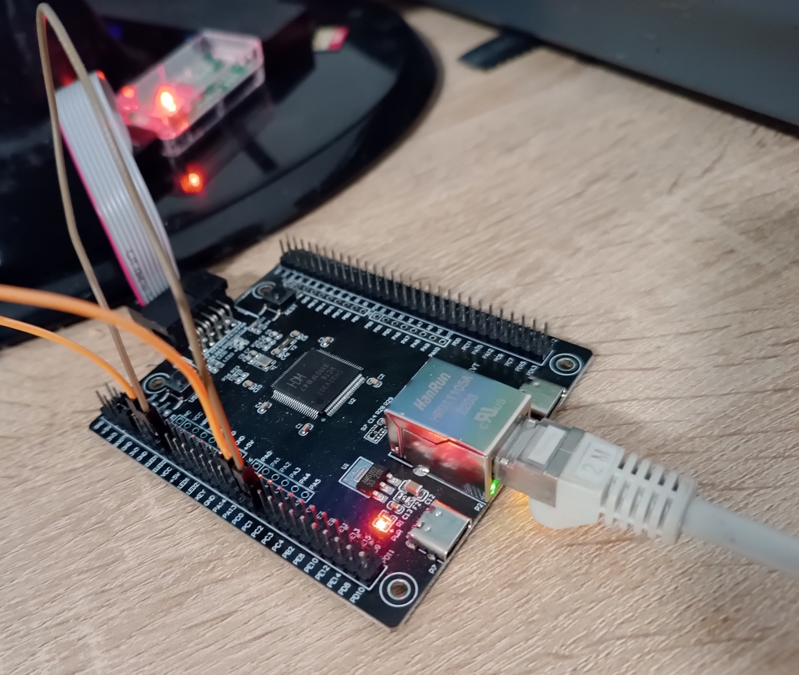
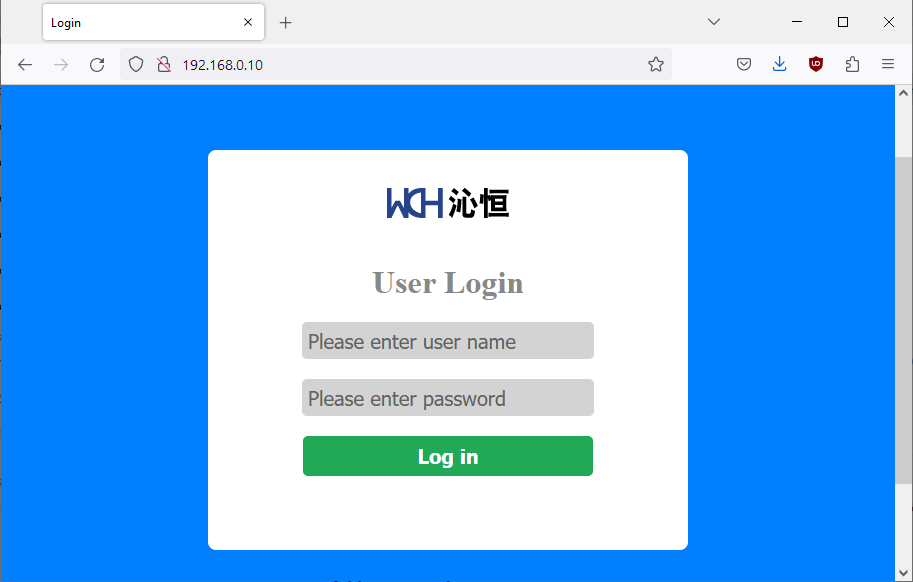
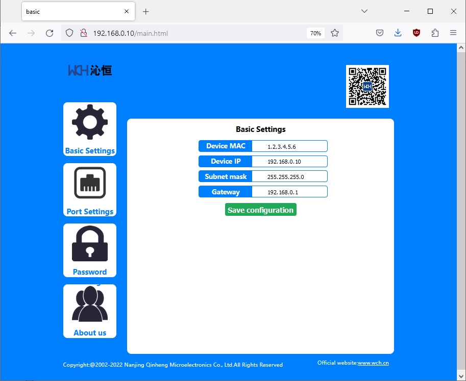

How to build PlatformIO based project
=====================================

1. [Install PlatformIO Core](https://docs.platformio.org/page/core.html)
2. Download [development platform with examples](https://github.com/Community-PIO-CH32V/platform-ch32v/archive/develop.zip)
3. Extract ZIP archive
4. Run these commands:

```shell
# Change directory to example
$ cd platform-ch32v/examples/webserver-ch32v307-none-os

# Build project
$ pio run

# Upload firmware
$ pio run --target upload

# Upload firmware for the specific environment
$ pio run -e ch32v307_evt --target upload

# Clean build files
$ pio run --target clean
```

## Description

This example is supposed to be run on a CH32V307 evaluation board with on-board ethernet jack, like the [CH32V307-EVT](https://www.aliexpress.com/item/1005004449629983.html).

This example opens both a webserver and runs a TCP client with configurable IP and target port in parallel. 

## Wireup

Since the MAC is on the MCU, the MCU needs to control the Ethernet LEDs. It does so on its GPIO pins PC0 and PC1. The development board has "ELED1" and "ELED2" pins. If you want the Ethernet LEDs to function properly, connect ELED1 to PC0 (LINK) and ELED2 to PC1 (DATA).

Further, you need connect an Ethernet cable to your board.



## Configuration

**DHCP is used for automatic IP acquisition.**

If you don't want this, edit the `lib/HTTP/HTTPS.c` file in regards to variable
```cpp
u8 Basic_Default[BASIC_CFG_LEN] = {
0x57, 0xAB,
01, 02, 03, 04, 05, 06, 192, 168, 0, 10, 255, 255, 255, 0, 192, 168, 0, 1};
```

As the `HTTPS.h` header shows, the contents of this buffer can be decoded as
```cpp
typedef struct Basic_Cfg   //Basic configuration parameters
{
	u8 flag[2];  //Configuration information verification code: 0x57,0xab
	u8 mac[6];
	u8 ip[4];
	u8 mask[4];
	u8 gateway[4];
} *Basic_Cfg;
```
So this configures 192.168.0.10 as the board's IP and 192.168.0.1 as the gateway.

Then, comment out the call to `WCHNET_DHCPStart(WCHNET_DHCPCallBack);` in `src/main.c`.

## Expected output

On the UART (at 115200 baud), the chip should hopefully detect a connected link:
```
Web Server
SystemClk:96000000
ChipID:30700518
net version:19
ip: 0.0.0.0.
mac addr:38 3b 26 3e d7 90
WCHNET_LibInit Success
SocketIdForListen 0
desport: 1000, srcport: 1000
desip:192.168.0.100
mode 1
__AMAC=1.2.3.4.5.6
__ASIP=0.0.0.0
__AMSK=255.255.255.0
__AGAT=0.0.0.0
PHY Link Success
DHCP Success
IPAddr: 192.168.0.10
GWIPAddr: 192.168.0.1
IPMask: 255.255.255.0
DNS1: 192.168.0.1
DNS2: 0.0.0.0
```
After that, http://192.168.0.10/ can be visited.



The login credentials are by default `admin:123`, changable in the `HTTPS.c`.

After that, the main page should load.



